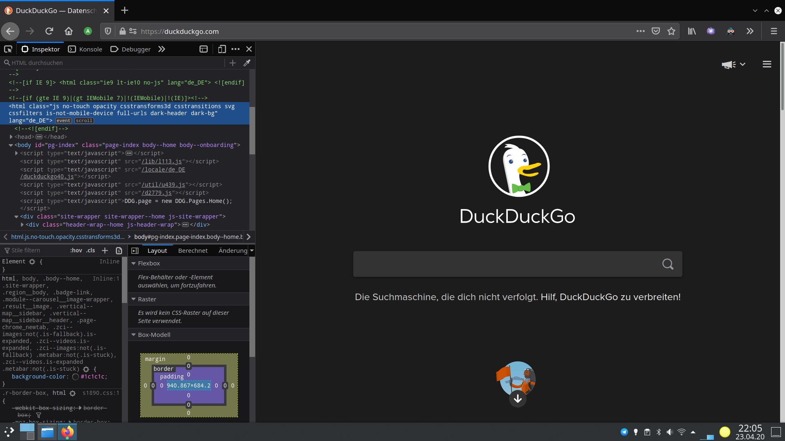
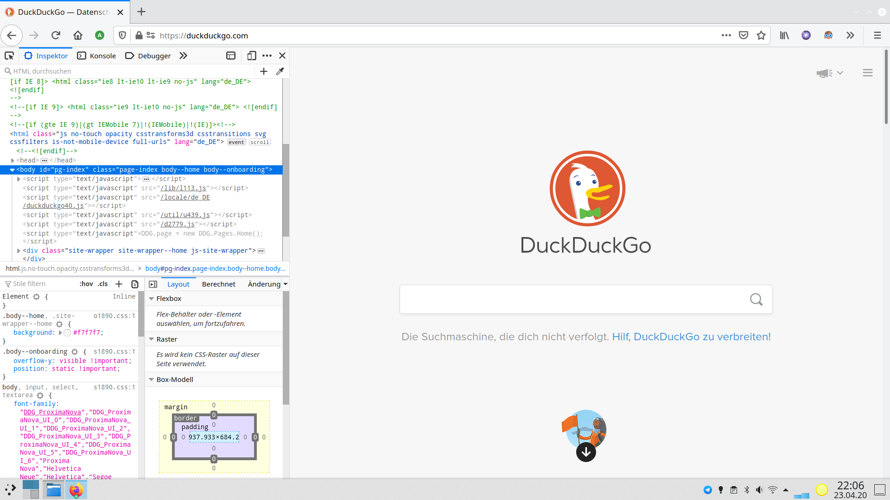

# Yin-Yang Firefox extension
This is a small extension that changes the theme of firefox according to settings from [Yin-Yang](https://github.com/daehruoydeef/Yin-Yang).
Please note that you need to have Yin Yang installed. If you change settings, the extension needs to be restartet.

This extension only alters the ui theme. Yin-Yang takes for of the theme in settings, in devtools and preferences. To apply these changes, Firefox needs to be restarted.

